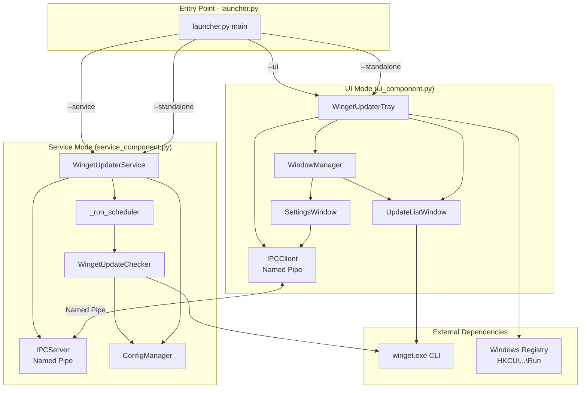

# Phase 1: Analysis of Winget_Updater Source Project

## 1. Project Identity

### 1.1 Language, Framework, Build System, Runtime

| Aspect | Details |
|--------|---------|
| **Primary Language** | Python 3.8+ |
| **UI Framework** | Tkinter (standard library) + pystray 0.19.4 for system tray |
| **Image Processing** | Pillow >= 11.0.0 (dynamic tray icons with version count overlay) |
| **Windows Integration** | pywin32 (win32service, win32pipe, win32file, win32event) |
| **Configuration** | configparser 5.3.0 (INI file format) |
| **Scheduling** | schedule 1.2.0 (time-based update checks) |
| **Build System** | PyInstaller >= 6.15.0 → standalone .exe |
| **Installer** | Inno Setup (via `winget_updater.iss`) |
| **Runtime** | CPython on Windows (Windows 10/11) |

### 1.2 Entry Points and Architecture

The application has **three runtime modes**, selected via CLI arguments in `launcher.py`:

```
launcher.py (main entry point)
├── --service        → Windows Service mode (service_component.py)
├── --ui             → UI/Tray-only mode (ui_component.py)
├── --standalone     → Both service + UI (default)
├── --debug          → Debug mode (both in-process, no service registration)
└── --install/--uninstall/--start/--stop/--restart → Service management
```

**Architecture Diagram (Mermaid):**



**Key Architectural Decisions:**
- Service runs scheduled checks; UI communicates via Named Pipe IPC (`\\.\pipe\WingetUpdaterPipe`)
- `system_tray.py` is an older/alternative implementation; `ui_component.py` is the active UI code
- `window_manager.py` is a singleton ensuring single Tk root and proper window focus handling

### 1.3 External Dependencies

| Dependency | Version | Purpose |
|------------|----------|---------|
| **pystray** | 0.19.4 | System tray icon with context menu, notifications, dynamic icon updates |
| **Pillow** | >= 11.0.0 | Generate multi-size ICO, draw version count overlay on tray icon |
| **pywin32** | *latest* | Windows Service API, Named Pipe IPC, Registry access |
| **configparser** | 5.3.0 | Read/write INI configuration (`settings.ini`) |
| **schedule** | 1.2.0 | Time-based scheduling (used in older `system_tray.py`, not `service_component.py` which uses manual loop) |
| **olefile** | 0.47 | Windows ICO file parsing (used by pystray dependency) |

---

## 2. Behavioral Contract

### 2.1 Inputs

**Command Line Arguments** (parsed by `launcher.py:parse_arguments()`):
```
--install           Install as Windows service (requires admin)
--uninstall         Uninstall Windows service (requires admin)
--start             Start the service
--stop              Stop the service
--restart           Restart the service
--service           Run service-only mode
--ui                Run UI-only mode
--standalone        Run both service and UI (default)
--debug             Enable debug logging, run in-process
--add-autostart     Add to Windows startup (HKCU\...\Run)
--remove-autostart  Remove from Windows startup
--verbose           Verbose logging
```

**Configuration File** (`%LOCALAPPDATA%\WingetUpdater\settings.ini`):
```ini
[Settings]
morning_check = HH:MM       # Default: 08:00
afternoon_check = HH:MM     # Default: 16:00
notify_on_updates = True    # Show balloon notifications
last_check = ISO8601        # Timestamp of last check
auto_check = True           # Enable scheduled checks
include_pinned_updates = False
include_unknown_versions = False
```

### 2.2 Outputs

**Log Files** (all UTF-8 text):
- `winget_updater.log` — Standalone mode
- `winget_updater_service.log` — Service mode
- `winget_updater_ui.log` — UI component
- `winget_updater_launcher.log` — Launcher

**IPC Responses** (JSON via Named Pipe `\\.\pipe\WingetUpdaterPipe`):

| Command | Response Data |
|---------|---------------|
| `check_updates` | `{"update_count": int, "success": bool, "last_check": ISO8601}` |
| `get_status` | `{"update_count": int, "last_check": ISO8601, "auto_check": bool, "morning_check": str, "afternoon_check": str}` |
| `get_updates` | `{"updates": [{name, id, current_version, available_version, source}], "count": int}` |
| `get_last_check` | `{"last_check": ISO8601 or null}` |
| `save_settings` | `{"success": bool, "error": str}` |
| `get_settings` | `{"morning_check": str, "afternoon_check": str, "notify_on_updates": bool, "auto_check": bool, "last_check": ISO8601 or null}` |

### 2.3 Side Effects

| Category | Side Effect |
|----------|--------------|
| **Registry** | Reads/writes `HKCU\SOFTWARE\Microsoft\Windows\CurrentVersion\Run` for autostart |
| **Winget Execution** | Runs `winget update`, `winget pin list`, `winget upgrade --all` as subprocess |
| **File System** | Creates `%LOCALAPPDATA%\WingetUpdater\settings.ini` |
| **Windows Service** | Registers/unregisters `WingetUpdaterService` via pywin32 |
| **System Tray** | Creates icon in notification area, displays notifications |

### 2.4 File Formats Read/Written

| File | Format | Purpose |
|------|--------|---------|
| `settings.ini` | INI (configparser) | Configuration persistence |
| `winget_updater.ico` | ICO (Pillow) | Application icon |
| `app.ico` | ICO | Alternative icon |
| Winget JSON output | JSON | Programmatic update listing (`winget update --format json`) |
| Winget text output | Text (space-delimited) | Fallback update listing |

### 2.5 Network Protocols and OS APIs

| Protocol/API | Usage |
|--------------|-------|
| **Named Pipes** (`\\.\pipe\WingetUpdaterPipe`) | IPC between service and UI via `win32pipe`, `win32file` |
| **Winget CLI** | Subprocess execution (`subprocess.run`, `asyncio.create_subprocess_exec`) |
| `CreateEvent` / `SetEvent` | Service stop event synchronization |
| `CreateService` / `DeleteService` | Windows Service registration |
| `IsUserAnAdmin` / `ShellExecuteW` | Privilege detection and elevation |
| `SetProcessDpiAwareness` | High DPI support in `window_manager.py` |
| `winreg` (HKCU) | Registry access for autostart |

### 2.6 Edge Cases and Error Handling

| Scenario | Handling |
|----------|-----------|
| Winget not installed | Log error, return 0 updates |
| Winget output format changed | Fallback: try JSON first (`--format json`), then parse text output |
| Service not running | UI reconnects every 0.5s with timeout of 10s |
| Named pipe broken (error 109) | Server: break, close pipe, wait for new client |
| Config file missing | Use defaults, create on first save |
| Config file corrupted | `configparser` may throw; catch Exception, use defaults |
| Widget focus issues (Tkinter) | Retry with `wm_attributes('-topmost', True/False)`, focus_force |
| Truncated package IDs (ends with `.`) | Match by prefix against pinned packages list |
| Version comparison unreliable | Skip package via `_is_valid_version_comparison()` |
| No admin for service install | Exit with error message to user |
| Tkinter `TclError` | Catch and log, clean up references |

---

## 3. Module / Responsibility Map

### 3.1 Source File Inventory

| File | Lines | Single-Sentence Purpose |
|------|-------|------------------------|
| **launcher.py** | 370 | CLI orchestration: parses arguments, manages service lifecycle, selects run mode |
| **main.py** | 206 | Original entry point with `WingetUpdaterService` (win32serviceutil) and standalone runner |
| **service_component.py** | 297 | Windows Service implementation with IPC server, scheduler, and command handlers |
| **ui_component.py** | 1978 | Primary UI: system tray, settings/update windows, IPC client, dynamic icon drawing |
| **update_checker.py** | 723 | Winget subprocess execution, JSON/text output parsing, update installation |
| **ipc_handler.py** | 250 | Named Pipe IPC server and client using `win32pipe`/`win32file`, JSON message serialization |
| **config_manager.py** | 131 | INI configuration read/write using `configparser`, stores to `%LOCALAPPDATA%\WingetUpdater\` |
| **system_tray.py** | 1299 | Older/alternative system tray implementation with `SystemTrayIcon`, `SettingsWindow`, `UpdateListWindow` |
| **window_manager.py** | 560 | Singleton Tkinter window manager: single root, focus handling, thread-safe window creation via queue |
| **build_installer.py** | 197 | PyInstaller + Inno Setup build script for creating standalone installer |
| **create_icon.py** | 49 | Generates multi-size ICO file from PNG for the application icon |

### 3.2 Public API Surface vs. Internal Helpers

**Public APIs:**

| Module | Public Classes/Functions |
|--------|-------------------------|
| `launcher.py` | `main()`, `is_admin()`, `run_as_admin()`, `install_service()`, `uninstall_service()`, `start_service()`, `stop_service()`, `restart_service()`, `run_ui_only()`, `run_service_only()`, `run_debug_mode()`, `run_standalone_mode()`, `autostart_setup()`, `parse_arguments()` |
| `service_component.py` | `WingetUpdaterService` class, `run_service()`, `run_service_debug()` |
| `ui_component.py` | `WingetUpdaterTray` class, `run_tray_application()`, `UpdateListWindow`, `SettingsWindow` |
| `update_checker.py` | `WingetUpdateChecker` class: `check_updates()`, `check_updates_async()`, `get_updates_list()`, `get_update_count()`, `install_all_updates()`, `get_last_check_time()` |
| `ipc_handler.py` | `IPCMessage` class, `IPCServer` class, `IPCClient` class |
| `config_manager.py` | `ConfigManager` class: all getter/setter pairs for config values |
| `system_tray.py` | `SystemTrayIcon` class, `UpdateListWindow`, `SettingsWindow` |
| `window_manager.py` | `WindowManager` singleton: `create_window()`, `close_window()`, `close_all_windows()`, `shutdown()` |

**Internal Helpers (not exported):**

| Module | Internal Methods |
|--------|-------------------|
| `update_checker.py` | `_parse_winget_output()`, `_parse_winget_json()`, `_check_updates_json()`, `_refresh_pinned_packages()`, `_is_package_pinned()`, `_is_valid_version_comparison()`, `_process_output_section()`, `_split_output_into_sections()`, `_should_skip_line()`, `_is_header_line()` |
| `ipc_handler.py` | `_run_server()`, `_handle_command()` |
| `ui_component.py` | All `_on_*`, `_create_*`, `_update_*`, `_ensure_*`, `_force_*` methods |
| `system_tray.py` | All `_on_*`, `_validate_*`, `_create_*` internal methods |
| `window_manager.py` | `_initialize_root()`, `_process_events()`, `_check_windows()`, `_execute_in_main_thread()`, `_configure_window()`, `_center_window()` |

### 3.3 Call Graph — Major Flows

**Update Check Flow (triggered by UI or scheduler):**
```
User clicks "Check for Updates" (UI)
    │
    ▼
WingetUpdaterTray._check_updates()  [ui_component.py]
    │  IPCClient.send_command("check_updates")
    ▼
IPCServer._handle_command("check_updates")  [ipc_handler.py]
    │  Calls registered handler
    ▼
WingetUpdaterService._handle_check_updates()  [service_component.py]
    │
    ▼
WingetUpdateChecker.check_updates()  [update_checker.py]
    │
    ├─► subprocess.run(['winget', 'update', '--include-unknown', '--include-pinned', '--accept-source-agreements'])
    │         OR
    ├─► subprocess.run(['winget', 'update', ..., '--format', 'json'])  (tried first)
    │
    ├─► _parse_winget_json()  (if JSON succeeds)
    │       Parses: data["Sources"][i]["Packages"] or data["Data"][i]
    │
    ├─► _parse_winget_output()  (text fallback)
    │       _split_output_into_sections() → _process_output_section()
    │       Regex: re.split(r'\s{2,}', line) to extract columns
    │
    ├─► Filters: _is_valid_version_comparison(), _is_package_pinned()
    │
    └─► Returns update_count → stored in self.available_updates[]
```

**Scheduled Update Flow (service_component.py):**
```
WingetUpdaterService._run_scheduler()  [thread, loops every 30s]
    │
    ├─► config_manager.get_auto_check() == True?
    │       │
    │       ▼
    │   current_time == morning_check OR current_time == afternoon_check?
    │       │
    │       ▼
    │   check_updates()
    │
    └─► update_count > 0 AND notify_on_updates == True?
            │
            ▼
        pystray icon.notify() → Windows notification
```

**Settings Save Flow (UI → Service):**
```
SettingsWindow.save_settings()  [ui_component.py]
    │  IPCClient.send_command("save_settings", {morning_check, afternoon_check, ...})
    ▼
IPCServer._handle_command("save_settings")
    │
    ▼
WingetUpdaterService._handle_save_settings(data)
    │
    ▼
ConfigManager.set_morning_check_time() / set_afternoon_check_time() / etc.
    │
    ▼
config.write() → settings.ini
```

---

## 4. Performance Profile

### 4.1 Hot Paths

| Path | Frequency | Duration | Notes |
|------|-----------|----------|-------|
| `winget update` subprocess | 2×/day (scheduled) + manual | 5–30 seconds | **Expensive**: spawns external process, parses stdout |
| `winget pin list` subprocess | Every update check | ~1–2 seconds | Called inside `_refresh_pinned_packages()` |
| IPC send/receive | Per user action (click) | < 100ms | Named pipe, low overhead |
| Scheduler loop | Every 30 seconds | Negligible | Simple time comparison |
| Settings save | On user save | Negligible | INI file write |
| JSON parsing (if used) | Per update check | ~10ms | `json.loads()` on winget output |
| Text parsing (fallback) | Per update check | ~50ms | Regex splitting + version validation per package |

### 4.2 Allocation Patterns

| Pattern | Location | Impact in C# Port |
|---------|----------|-------------------|
| `json.loads(output)` | `update_checker.py:231` | Produces `dict`/`list` tree; in C# use `System.Text.Json` which is low-alloc with `Utf8JsonReader` |
| `output.strip().split('\n')` | `update_checker.py:342` | Allocates `List<string>`; in C# use `ReadOnlySpan<char>` or `Utf8JsonReader` to avoid |
| `re.split(r'\s{2,}', line)` | `update_checker.py:468` | Allocates multiple strings per package; in C# use `ReadOnlySpan<char>` slicing |
| `self.available_updates = []` | Multiple locations | Clears and rebuilds list each check; in C# reuse `List<UpdateInfo>` with `.Clear()` |
| `subprocess.run()` | Multiple locations | Spawns OS process; no allocation concern for C# port (will use `Process.Start`) |
| `IPCMessage.to_json()` | `ipc_handler.py:23` | Allocates JSON string each message; consider `System.Text.Json` Utf8 output |

### 4.3 I/O Patterns

| I/O Type | Pattern | C# Consideration |
|----------|---------|------------------|
| **Subprocess** | `subprocess.run()` / `asyncio.create_subprocess_exec()` | Use `Process.Start()` with `ReadToEnd()` or async `Process` class |
| **File I/O** | `config.write()` / `config.read()` | Use `StreamWriter`/`StreamReader` or `File.WriteAllText` for INI |
| **Named Pipe** | `win32pipe.CreateNamedPipe()` / `ReadFile()` / `WriteFile()` | Use `NamedPipeServerStream` / `NamedPipeClientStream` |
| **Logging** | `logging.basicConfig(filename=...)` | Use `ILogger<T>` with `Microsoft.Extensions.Logging` |
| **Registry** | `winreg.OpenKey()` / `SetValueEx()` | Use `Microsoft.Win32.Registry` classes |

### 4.4 Considerations for Managed Memory (C#)

1. **Winget output parsing is the main hot path for allocations**:
   - Python: `json.loads()` → `dict`/`list` tree allocated on heap
   - C#: Use `Utf8JsonReader` for zero-alloc forward-only JSON parsing, or `JsonDocument` for DOM if needed
   - Text parsing: Use `ReadOnlySpan<char>` to slice lines without allocating substrings

2. **Pinned packages cache** (`self.pinned_packages = set()`):
   - Python: `set()` of strings, rebuilt each check
   - C#: Use `HashSet<string>` and reuse/clear, or make `ImmutableHashSet<string>` if read-only after refresh

3. **`available_updates` list**:
   - Python: Rebuilt as new `[]` list each check
   - C#: Reuse `List<UpdateInfo>` with `.Clear()` to avoid GC pressure

4. **IPC message serialization**:
   - Python: `json.dumps()` allocates string each message
   - C#: Use `System.Text.Json` which can serialize to `Utf8JsonWriter` (no string allocation)

5. **No large binary data** — all text-based I/O, no concerns about large buffer allocations

---

## 5. Open Questions

1. **`schedule` package usage**: The `service_component.py` uses a manual `time.sleep(30)` loop for scheduling, but `system_tray.py` imports `schedule`. The `schedule` package is listed as a dependency but not actively used in the main service path. **Decision**: Do not port `schedule`; use `System.Threading.Timer` or manual loop in C#.

2. **`system_tray.py` vs `ui_component.py`**: There are two implementations of the system tray. `ui_component.py` appears to be the active one (imported by `launcher.py`), while `system_tray.py` is an older version. **Decision**: Port `ui_component.py` only; note `system_tray.py` as legacy in the analysis.

3. **`asyncio` usage in `update_checker.py`**: `check_updates_async()` exists but is never called from the service or UI. The sync `check_updates()` is used everywhere. **Decision**: Port synchronous version only; C# `async/await` can be added later if needed.

4. **`create_icon.py` and dynamic icon generation**: `ui_component.py` generates tray icons dynamically using Pillow (draws version count on icon). This is a significant feature. **Decision**: Use `System.Drawing` or `ImageSharp` for dynamic icon generation in C#.

5. **Winget JSON output format**: The code tries multiple JSON command variants (`winget update --format json`, `winget upgrade --format json`, etc.) because the format changed across winget versions. **Decision**: Try JSON first, fall back to text parsing, same as Python version.

6. **DPI awareness**: `window_manager.py` calls `SetProcessDpiAwareness(1)` via ctypes. **Decision**: Use `Application.SetHighDpiMode(HighDpiMode.SystemAware)` in .NET 8.

7. **Psutil dependency**: `window_manager.py` optionally uses `psutil` to set process priority to HIGH. This is a nice-to-have, not critical. **Decision**: Use `Process.PriorityClass = ProcessPriorityClass.High` in C# if needed.

---

## Summary

The Winget_Updater is a Python/Windows application with:
- **3 runtime modes**: Service, UI/Tray, Standalone (both)
- **Core function**: Periodically check for Winget package updates via subprocess, notify user, allow install
- **IPC**: Named Pipes between service and UI
- **Config**: INI file in `%LOCALAPPDATA%`
- **UI**: Tkinter + pystray for system tray with dynamic icons
- **Port complexity**: Moderate — mainly subprocess management, text/JSON parsing, and Windows-specific APIs (Named Pipes, Service, Registry)
